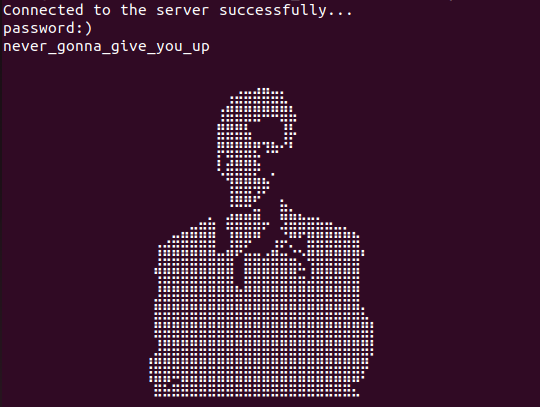

# GOtchu

**Author**: Mayhul

You are a hitman who want to contact to his client via chat. The client being paranoid sent encrypted message to you.
Can you tell the message?

Given to user:
- question/secAgent

**Solution**:

1. Make the file executable `chmod +x secAgent`

2. Run it using `./secAgent`

3. go tool objdump -s "main.main" secAgent 

```
  client.go:11		0x4c5200		4c8da424f8fdffff		LEAQ 0xfffffdf8(SP), R12		
  client.go:11		0x4c5208		4d3b6610			CMPQ 0x10(R14), R12			
  client.go:11		0x4c520c		0f8604070000			JBE 0x4c5916				
  client.go:11		0x4c5212		4881ec88020000			SUBQ $0x288, SP				
  client.go:11		0x4c5219		4889ac2480020000		MOVQ BP, 0x280(SP)			
  client.go:11		0x4c5221		488dac2480020000		LEAQ 0x280(SP), BP			
  client.go:13		0x4c5229		488d05716a0200			LEAQ 0x26a71(IP), AX			
  client.go:13		0x4c5230		bb03000000			MOVL $0x3, BX				
  client.go:13		0x4c5235		488d0d1d850200			LEAQ 0x2851d(IP), CX			
  client.go:13		0x4c523c		bf0e000000			MOVL $0xe, DI				
  client.go:13		0x4c5241		e87a03feff			CALL net.Dial(SB)			
  client.go:14		0x4c5246		4885c9				TESTQ CX, CX				
  client.go:14		0x4c5249		7452				JE 0x4c529d				
  client.go:15		0x4c524b		440f11bc24d0000000		MOVUPS X15, 0xd0(SP)			
  client.go:15		0x4c5254		7404				JE 0x4c525a				
  client.go:15		0x4c5256		488b4908			MOVQ 0x8(CX), CX			
  client.go:15		0x4c525a		48898c24d0000000		MOVQ CX, 0xd0(SP)			
  client.go:15		0x4c5262		4889bc24d8000000		MOVQ DI, 0xd8(SP)			
  print.go:274		0x4c526a		488b1d3f490e00			MOVQ os.Stdout(SB), BX			
  print.go:274		0x4c5271		488d05b0e10400			LEAQ go.itab.*os.File,io.Writer(SB), AX	
  print.go:274		0x4c5278		488d8c24d0000000		LEAQ 0xd0(SP), CX			
  print.go:274		0x4c5280		bf01000000			MOVL $0x1, DI				
  print.go:274		0x4c5285		4889fe				MOVQ DI, SI				
  print.go:274		0x4c5288		e8d3defcff			CALL fmt.Fprintln(SB)			
  client.go:16		0x4c528d		488bac2480020000		MOVQ 0x280(SP), BP			
  client.go:16		0x4c5295		4881c488020000			ADDQ $0x288, SP				
  client.go:16		0x4c529c		c3				RET					
  client.go:62		0x4c529d		48895c2468			MOVQ BX, 0x68(SP)			
  client.go:62		0x4c52a2		4889842488000000		MOVQ AX, 0x88(SP)			
  client.go:18		0x4c52aa		440f11bc24c0000000		MOVUPS X15, 0xc0(SP)			
  client.go:18		0x4c52b3		488d15a6bd0000			LEAQ 0xbda6(IP), DX			
  client.go:18		0x4c52ba		48899424c0000000		MOVQ DX, 0xc0(SP)			
  client.go:18		0x4c52c2		4c8d059fdb0400			LEAQ 0x4db9f(IP), R8			
  client.go:18		0x4c52c9		4c898424c8000000		MOVQ R8, 0xc8(SP)			
  print.go:274		0x4c52d1		488b1dd8480e00			MOVQ os.Stdout(SB), BX			
  print.go:274		0x4c52d8		488d0549e10400			LEAQ go.itab.*os.File,io.Writer(SB), AX	
  print.go:274		0x4c52df		488d8c24c0000000		LEAQ 0xc0(SP), CX			
  print.go:274		0x4c52e7		bf01000000			MOVL $0x1, DI				
  print.go:274		0x4c52ec		4889fe				MOVQ DI, SI				
  print.go:274		0x4c52ef		e86cdefcff			CALL fmt.Fprintln(SB)			
  client.go:22		0x4c52f4		488b15ad480e00			MOVQ os.Stdin(SB), DX			
  client.go:22		0x4c52fb		4889942480000000		MOVQ DX, 0x80(SP)			
  bufio.go:63		0x4c5303		90				NOPL					
  bufio.go:56		0x4c5304		440f11bc2428020000		MOVUPS X15, 0x228(SP)			
  bufio.go:56		0x4c530d		488dbc2430020000		LEAQ 0x230(SP), DI			
  bufio.go:56		0x4c5315		488d7fd0			LEAQ -0x30(DI), DI			
  bufio.go:56		0x4c5319		0f1f8000000000			NOPL 0(AX)				
  bufio.go:56		0x4c5320		48896c24f0			MOVQ BP, -0x10(SP)			
  bufio.go:56		0x4c5325		488d6c24f0			LEAQ -0x10(SP), BP			
  bufio.go:56		0x4c532a		e801c0f9ff			CALL 0x461330				
  bufio.go:56		0x4c532f		488b6d00			MOVQ 0(BP), BP				
  bufio.go:57		0x4c5333		488d05a6be0000			LEAQ 0xbea6(IP), AX			
  bufio.go:57		0x4c533a		bb00100000			MOVL $0x1000, BX			
  bufio.go:57		0x4c533f		4889d9				MOVQ BX, CX				
  bufio.go:57		0x4c5342		e81947f8ff			CALL runtime.makeslice(SB)		
  bufio.go:81		0x4c5347		440f11bc24d0010000		MOVUPS X15, 0x1d0(SP)			
  bufio.go:81		0x4c5350		488dbc24d8010000		LEAQ 0x1d8(SP), DI			
  bufio.go:81		0x4c5358		488d7fd0			LEAQ -0x30(DI), DI			
  bufio.go:81		0x4c535c		0f1f4000			NOPL 0(AX)				
  bufio.go:81		0x4c5360		48896c24f0			MOVQ BP, -0x10(SP)			
  bufio.go:81		0x4c5365		488d6c24f0			LEAQ -0x10(SP), BP			
  bufio.go:81		0x4c536a		e8c1bff9ff			CALL 0x461330				
  bufio.go:81		0x4c536f		488b6d00			MOVQ 0(BP), BP				
  bufio.go:82		0x4c5373		48898424d0010000		MOVQ AX, 0x1d0(SP)			
  bufio.go:82		0x4c537b		48c78424d801000000100000	MOVQ $0x1000, 0x1d8(SP)			
  bufio.go:82		0x4c5387		48c78424e001000000100000	MOVQ $0x1000, 0x1e0(SP)			
  bufio.go:83		0x4c5393		488d156ee00400			LEAQ go.itab.*os.File,io.Reader(SB), DX	
  bufio.go:83		0x4c539a		48899424e8010000		MOVQ DX, 0x1e8(SP)			
  bufio.go:83		0x4c53a2		4c8b842480000000		MOVQ 0x80(SP), R8			
  bufio.go:83		0x4c53aa		4c898424f0010000		MOVQ R8, 0x1f0(SP)			
  bufio.go:84		0x4c53b2		48c7842418020000ffffffff	MOVQ $-0x1, 0x218(SP)			
  bufio.go:85		0x4c53be		48c7842420020000ffffffff	MOVQ $-0x1, 0x220(SP)			
  bufio.go:81		0x4c53ca		4c8b8424d0010000		MOVQ 0x1d0(SP), R8			
  bufio.go:81		0x4c53d2		4c89842428020000		MOVQ R8, 0x228(SP)			
  bufio.go:81		0x4c53da		488dbc2430020000		LEAQ 0x230(SP), DI			
  bufio.go:81		0x4c53e2		488db424d8010000		LEAQ 0x1d8(SP), SI			
  bufio.go:81		0x4c53ea		48896c24f0			MOVQ BP, -0x10(SP)			
  bufio.go:81		0x4c53ef		488d6c24f0			LEAQ -0x10(SP), BP			
  bufio.go:81		0x4c53f4		e8a1c2f9ff			CALL 0x46169a				
  bufio.go:81		0x4c53f9		488b6d00			MOVQ 0(BP), BP				
  client.go:22		0x4c53fd		488d842428020000		LEAQ 0x228(SP), AX			
  client.go:22		0x4c5405		bb0a000000			MOVL $0xa, BX				
  client.go:22		0x4c540a		e8f173faff			CALL bufio.(*Reader).ReadString(SB)	
  client.go:22		0x4c540f		4889442478			MOVQ AX, 0x78(SP)			
  client.go:22		0x4c5414		48895c2440			MOVQ BX, 0x40(SP)			
  client.go:23		0x4c5419		e8226cfaff			CALL strings.TrimSpace(SB)		
  client.go:23		0x4c541e		6690				NOPW					
  client.go:23		0x4c5420		4883fb10			CMPQ $0x10, BX				
  client.go:23		0x4c5424		0f850c010000			JNE 0x4c5536				
  client.go:23		0x4c542a		48b9636c6f73655f636f		MOVQ $0x6f635f65736f6c63, CX		
  client.go:23		0x4c5434		483908				CMPQ CX, 0(AX)				
  client.go:23		0x4c5437		0f85f9000000			JNE 0x4c5536				
  client.go:23		0x4c543d		48b96e6e656374696f6e		MOVQ $0x6e6f697463656e6e, CX		
  client.go:23		0x4c5447		48394808			CMPQ CX, 0x8(AX)			
  client.go:23		0x4c544b		0f85e5000000			JNE 0x4c5536				
  client.go:24		0x4c5451		488d05681c0100			LEAQ 0x11c68(IP), AX			
  client.go:24		0x4c5458		488b9c2488000000		MOVQ 0x88(SP), BX			
  client.go:24		0x4c5460		e8bb62f4ff			CALL runtime.convI2I(SB)		
  client.go:24		0x4c5465		488b5c2468			MOVQ 0x68(SP), BX			
  client.go:24		0x4c546a		488d0d34670200			LEAQ 0x26734(IP), CX			
  client.go:24		0x4c5471		bf02000000			MOVL $0x2, DI				
  client.go:24		0x4c5476		31f6				XORL SI, SI				
  client.go:24		0x4c5478		4531c0				XORL R8, R8				
  client.go:24		0x4c547b		4d89c1				MOVQ R8, R9				
  client.go:24		0x4c547e		6690				NOPW					
  client.go:24		0x4c5480		e8bbdbfcff			CALL fmt.Fprintf(SB)			
  client.go:25		0x4c5485		4885db				TESTQ BX, BX				
  client.go:25		0x4c5488		7452				JE 0x4c54dc				
  client.go:25		0x4c548a		440f11bc24b0000000		MOVUPS X15, 0xb0(SP)			
  client.go:25		0x4c5493		7404				JE 0x4c5499				
  client.go:25		0x4c5495		488b5b08			MOVQ 0x8(BX), BX			
  client.go:25		0x4c5499		48899c24b0000000		MOVQ BX, 0xb0(SP)			
  client.go:25		0x4c54a1		48898c24b8000000		MOVQ CX, 0xb8(SP)			
  print.go:274		0x4c54a9		488b1d00470e00			MOVQ os.Stdout(SB), BX			
  print.go:274		0x4c54b0		488d0571df0400			LEAQ go.itab.*os.File,io.Writer(SB), AX	
  print.go:274		0x4c54b7		488d8c24b0000000		LEAQ 0xb0(SP), CX			
  print.go:274		0x4c54bf		bf01000000			MOVL $0x1, DI				
  print.go:274		0x4c54c4		4889fe				MOVQ DI, SI				
  print.go:274		0x4c54c7		e894dcfcff			CALL fmt.Fprintln(SB)			
  client.go:25		0x4c54cc		488bac2480020000		MOVQ 0x280(SP), BP			
  client.go:25		0x4c54d4		4881c488020000			ADDQ $0x288, SP				
  client.go:25		0x4c54db		c3				RET					
  client.go:27		0x4c54dc		440f11bc24a0000000		MOVUPS X15, 0xa0(SP)			
  client.go:27		0x4c54e5		488d1574bb0000			LEAQ 0xbb74(IP), DX			
  client.go:27		0x4c54ec		48899424a0000000		MOVQ DX, 0xa0(SP)			
  client.go:27		0x4c54f4		488d157dd90400			LEAQ 0x4d97d(IP), DX			
  client.go:27		0x4c54fb		48899424a8000000		MOVQ DX, 0xa8(SP)			
  print.go:274		0x4c5503		488b1da6460e00			MOVQ os.Stdout(SB), BX			
  print.go:274		0x4c550a		488d0517df0400			LEAQ go.itab.*os.File,io.Writer(SB), AX	
  print.go:274		0x4c5511		488d8c24a0000000		LEAQ 0xa0(SP), CX			
  print.go:274		0x4c5519		bf01000000			MOVL $0x1, DI				
  print.go:274		0x4c551e		4889fe				MOVQ DI, SI				
  print.go:274		0x4c5521		e83adcfcff			CALL fmt.Fprintln(SB)			
  client.go:28		0x4c5526		488bac2480020000		MOVQ 0x280(SP), BP			
  client.go:28		0x4c552e		4881c488020000			ADDQ $0x288, SP				
  client.go:28		0x4c5535		c3				RET					
  client.go:30		0x4c5536		488b442478			MOVQ 0x78(SP), AX			
  client.go:30		0x4c553b		488b5c2440			MOVQ 0x40(SP), BX			
  client.go:30		0x4c5540		e8fb6afaff			CALL strings.TrimSpace(SB)		
  client.go:30		0x4c5545		4883fb0a			CMPQ $0xa, BX				
  client.go:30		0x4c5549		0f85dd020000			JNE 0x4c582c				
  client.go:30		0x4c554f		48ba70617373776f7264		MOVQ $0x64726f7773736170, DX		
  client.go:30		0x4c5559		0f1f8000000000			NOPL 0(AX)				
  client.go:30		0x4c5560		483910				CMPQ DX, 0(AX)				
  client.go:30		0x4c5563		0f85c3020000			JNE 0x4c582c				
  client.go:30		0x4c5569		668178083a29			CMPW $0x293a, 0x8(AX)			
  client.go:30		0x4c556f		0f85b7020000			JNE 0x4c582c				
  client.go:31		0x4c5575		488b152c460e00			MOVQ os.Stdin(SB), DX			
  client.go:31		0x4c557c		4889942480000000		MOVQ DX, 0x80(SP)			
  bufio.go:63		0x4c5584		90				NOPL					
  bufio.go:56		0x4c5585		440f11bc2478010000		MOVUPS X15, 0x178(SP)			
  bufio.go:56		0x4c558e		488dbc2480010000		LEAQ 0x180(SP), DI			
  bufio.go:56		0x4c5596		488d7fd0			LEAQ -0x30(DI), DI			
  bufio.go:56		0x4c559a		660f1f440000			NOPW 0(AX)(AX*1)			
  bufio.go:56		0x4c55a0		48896c24f0			MOVQ BP, -0x10(SP)			
  bufio.go:56		0x4c55a5		488d6c24f0			LEAQ -0x10(SP), BP			
  bufio.go:56		0x4c55aa		e881bdf9ff			CALL 0x461330				
  bufio.go:56		0x4c55af		488b6d00			MOVQ 0(BP), BP				
  bufio.go:57		0x4c55b3		488d0526bc0000			LEAQ 0xbc26(IP), AX			
  bufio.go:57		0x4c55ba		bb00100000			MOVL $0x1000, BX			
  bufio.go:57		0x4c55bf		4889d9				MOVQ BX, CX				
  bufio.go:57		0x4c55c2		e89944f8ff			CALL runtime.makeslice(SB)		
  bufio.go:81		0x4c55c7		440f11bc2420010000		MOVUPS X15, 0x120(SP)			
  bufio.go:81		0x4c55d0		488dbc2428010000		LEAQ 0x128(SP), DI			
  bufio.go:81		0x4c55d8		488d7fd0			LEAQ -0x30(DI), DI			
  bufio.go:81		0x4c55dc		0f1f4000			NOPL 0(AX)				
  bufio.go:81		0x4c55e0		48896c24f0			MOVQ BP, -0x10(SP)			
  bufio.go:81		0x4c55e5		488d6c24f0			LEAQ -0x10(SP), BP			
  bufio.go:81		0x4c55ea		e841bdf9ff			CALL 0x461330				
  bufio.go:81		0x4c55ef		488b6d00			MOVQ 0(BP), BP				
  bufio.go:82		0x4c55f3		4889842420010000		MOVQ AX, 0x120(SP)			
  bufio.go:82		0x4c55fb		48c784242801000000100000	MOVQ $0x1000, 0x128(SP)			
  bufio.go:82		0x4c5607		48c784243001000000100000	MOVQ $0x1000, 0x130(SP)			
  bufio.go:83		0x4c5613		488d15eedd0400			LEAQ go.itab.*os.File,io.Reader(SB), DX	
  bufio.go:83		0x4c561a		4889942438010000		MOVQ DX, 0x138(SP)			
  bufio.go:83		0x4c5622		488b942480000000		MOVQ 0x80(SP), DX			
  bufio.go:83		0x4c562a		4889942440010000		MOVQ DX, 0x140(SP)			
  bufio.go:84		0x4c5632		48c7842468010000ffffffff	MOVQ $-0x1, 0x168(SP)			
  bufio.go:85		0x4c563e		48c7842470010000ffffffff	MOVQ $-0x1, 0x170(SP)			
  bufio.go:81		0x4c564a		488b942420010000		MOVQ 0x120(SP), DX			
  bufio.go:81		0x4c5652		4889942478010000		MOVQ DX, 0x178(SP)			
  bufio.go:81		0x4c565a		488dbc2480010000		LEAQ 0x180(SP), DI			
  bufio.go:81		0x4c5662		488db42428010000		LEAQ 0x128(SP), SI			
  bufio.go:81		0x4c566a		48896c24f0			MOVQ BP, -0x10(SP)			
  bufio.go:81		0x4c566f		488d6c24f0			LEAQ -0x10(SP), BP			
  bufio.go:81		0x4c5674		e821c0f9ff			CALL 0x46169a				
  bufio.go:81		0x4c5679		488b6d00			MOVQ 0(BP), BP				
  client.go:31		0x4c567d		488d842478010000		LEAQ 0x178(SP), AX			
  client.go:31		0x4c5685		bb0a000000			MOVL $0xa, BX				
  client.go:31		0x4c568a		e87171faff			CALL bufio.(*Reader).ReadString(SB)	
  client.go:31		0x4c568f		4889442470			MOVQ AX, 0x70(SP)			
  client.go:31		0x4c5694		48895c2438			MOVQ BX, 0x38(SP)			
  client.go:32		0x4c5699		e8a269faff			CALL strings.TrimSpace(SB)		
  client.go:32		0x4c569e		6690				NOPW					
  client.go:32		0x4c56a0		4883fb17			CMPQ $0x17, BX				
  client.go:32		0x4c56a4		7513				JNE 0x4c56b9				
  client.go:32		0x4c56a6		4889d9				MOVQ BX, CX				
  client.go:32		0x4c56a9		488d1d28a20200			LEAQ 0x2a228(IP), BX			
  client.go:32		0x4c56b0		e8cbd3f3ff			CALL runtime.memequal(SB)		
  client.go:32		0x4c56b5		84c0				TESTL AL, AL				
  client.go:32		0x4c56b7		755c				JNE 0x4c5715				
  client.go:59		0x4c56b9		440f11bc2400010000		MOVUPS X15, 0x100(SP)			
  client.go:59		0x4c56c2		488d1597b90000			LEAQ 0xb997(IP), DX			
  client.go:59		0x4c56c9		4889942400010000		MOVQ DX, 0x100(SP)			
  client.go:59		0x4c56d1		488d15b0d70400			LEAQ 0x4d7b0(IP), DX			
  client.go:59		0x4c56d8		4889942408010000		MOVQ DX, 0x108(SP)			
  print.go:274		0x4c56e0		488b1dc9440e00			MOVQ os.Stdout(SB), BX			
  print.go:274		0x4c56e7		488d053add0400			LEAQ go.itab.*os.File,io.Writer(SB), AX	
  print.go:274		0x4c56ee		488d8c2400010000		LEAQ 0x100(SP), CX			
  print.go:274		0x4c56f6		bf01000000			MOVL $0x1, DI				
  print.go:274		0x4c56fb		4889fe				MOVQ DI, SI				
  print.go:274		0x4c56fe		6690				NOPW					
  print.go:274		0x4c5700		e85bdafcff			CALL fmt.Fprintln(SB)			
  client.go:60		0x4c5705		488bac2480020000		MOVQ 0x280(SP), BP			
  client.go:60		0x4c570d		4881c488020000			ADDQ $0x288, SP				
  client.go:60		0x4c5714		c3				RET					
  client.go:53		0x4c5715		440f11bc2490000000		MOVUPS X15, 0x90(SP)			
  client.go:53		0x4c571e		488d059cf70200			LEAQ 0x2f79c(IP), AX			
  client.go:53		0x4c5725		bb580a0000			MOVL $0xa58, BX				
  client.go:53		0x4c572a		e8915ef4ff			CALL runtime.convTstring(SB)		
  client.go:53		0x4c572f		488d0d2ab90000			LEAQ 0xb92a(IP), CX			
  client.go:53		0x4c5736		48898c2490000000		MOVQ CX, 0x90(SP)			
  client.go:53		0x4c573e		4889842498000000		MOVQ AX, 0x98(SP)			
  print.go:274		0x4c5746		488b1d63440e00			MOVQ os.Stdout(SB), BX			
  print.go:274		0x4c574d		488d05d4dc0400			LEAQ go.itab.*os.File,io.Writer(SB), AX	
  print.go:274		0x4c5754		488d8c2490000000		LEAQ 0x90(SP), CX			
  print.go:274		0x4c575c		bf01000000			MOVL $0x1, DI				
  print.go:274		0x4c5761		4889fe				MOVQ DI, SI				
  print.go:274		0x4c5764		e8f7d9fcff			CALL fmt.Fprintln(SB)			
  client.go:54		0x4c5769		488d0550190100			LEAQ 0x11950(IP), AX			
  client.go:54		0x4c5770		488b9c2488000000		MOVQ 0x88(SP), BX			
  client.go:54		0x4c5778		e8a35ff4ff			CALL runtime.convI2I(SB)		
  client.go:54		0x4c577d		4889842488000000		MOVQ AX, 0x88(SP)			
  client.go:54		0x4c5785		488b5c2470			MOVQ 0x70(SP), BX			
  client.go:54		0x4c578a		488b4c2438			MOVQ 0x38(SP), CX			
  client.go:54		0x4c578f		488d3df3630200			LEAQ 0x263f3(IP), DI			
  client.go:54		0x4c5796		be01000000			MOVL $0x1, SI				
  client.go:54		0x4c579b		488d442448			LEAQ 0x48(SP), AX			
  client.go:54		0x4c57a0		e85b7df8ff			CALL runtime.concatstring2(SB)		
  client.go:54		0x4c57a5		4889c1				MOVQ AX, CX				
  client.go:54		0x4c57a8		4889df				MOVQ BX, DI				
  client.go:54		0x4c57ab		31f6				XORL SI, SI				
  client.go:54		0x4c57ad		4531c0				XORL R8, R8				
  client.go:54		0x4c57b0		4d89c1				MOVQ R8, R9				
  client.go:54		0x4c57b3		488b842488000000		MOVQ 0x88(SP), AX			
  client.go:54		0x4c57bb		488b5c2468			MOVQ 0x68(SP), BX			
  client.go:54		0x4c57c0		e87bd8fcff			CALL fmt.Fprintf(SB)			
  client.go:55		0x4c57c5		4885db				TESTQ BX, BX				
  client.go:55		0x4c57c8		7452				JE 0x4c581c				
  client.go:55		0x4c57ca		440f11bc2410010000		MOVUPS X15, 0x110(SP)			
  client.go:55		0x4c57d3		7404				JE 0x4c57d9				
  client.go:55		0x4c57d5		488b5b08			MOVQ 0x8(BX), BX			
  client.go:55		0x4c57d9		48899c2410010000		MOVQ BX, 0x110(SP)			
  client.go:55		0x4c57e1		48898c2418010000		MOVQ CX, 0x118(SP)			
  print.go:274		0x4c57e9		488b1dc0430e00			MOVQ os.Stdout(SB), BX			
  print.go:274		0x4c57f0		488d0531dc0400			LEAQ go.itab.*os.File,io.Writer(SB), AX	
  print.go:274		0x4c57f7		488d8c2410010000		LEAQ 0x110(SP), CX			
  print.go:274		0x4c57ff		bf01000000			MOVL $0x1, DI				
  print.go:274		0x4c5804		4889fe				MOVQ DI, SI				
  print.go:274		0x4c5807		e854d9fcff			CALL fmt.Fprintln(SB)			
  client.go:55		0x4c580c		488bac2480020000		MOVQ 0x280(SP), BP			
  client.go:55		0x4c5814		4881c488020000			ADDQ $0x288, SP				
  client.go:55		0x4c581b		c3				RET					
  client.go:57		0x4c581c		488bac2480020000		MOVQ 0x280(SP), BP			
  client.go:57		0x4c5824		4881c488020000			ADDQ $0x288, SP				
  client.go:57		0x4c582b		c3				RET					
  client.go:62		0x4c582c		488d058d180100			LEAQ 0x1188d(IP), AX			
  client.go:62		0x4c5833		488b9c2488000000		MOVQ 0x88(SP), BX			
  client.go:62		0x4c583b		0f1f440000			NOPL 0(AX)(AX*1)			
  client.go:62		0x4c5840		e8db5ef4ff			CALL runtime.convI2I(SB)		
  client.go:62		0x4c5845		488b5c2468			MOVQ 0x68(SP), BX			
  client.go:62		0x4c584a		488d0d1e6e0200			LEAQ 0x26e1e(IP), CX			
  client.go:62		0x4c5851		bf08000000			MOVL $0x8, DI				
  client.go:62		0x4c5856		31f6				XORL SI, SI				
  client.go:62		0x4c5858		4531c0				XORL R8, R8				
  client.go:62		0x4c585b		4d89c1				MOVQ R8, R9				
  client.go:62		0x4c585e		6690				NOPW					
  client.go:62		0x4c5860		e8dbd7fcff			CALL fmt.Fprintf(SB)			
  client.go:63		0x4c5865		4885db				TESTQ BX, BX				
  client.go:63		0x4c5868		7452				JE 0x4c58bc				
  client.go:63		0x4c586a		440f11bc24f0000000		MOVUPS X15, 0xf0(SP)			
  client.go:63		0x4c5873		7404				JE 0x4c5879				
  client.go:63		0x4c5875		488b5b08			MOVQ 0x8(BX), BX			
  client.go:63		0x4c5879		48899c24f0000000		MOVQ BX, 0xf0(SP)			
  client.go:63		0x4c5881		48898c24f8000000		MOVQ CX, 0xf8(SP)			
  print.go:274		0x4c5889		488b1d20430e00			MOVQ os.Stdout(SB), BX			
  print.go:274		0x4c5890		488d0591db0400			LEAQ go.itab.*os.File,io.Writer(SB), AX	
  print.go:274		0x4c5897		488d8c24f0000000		LEAQ 0xf0(SP), CX			
  print.go:274		0x4c589f		bf01000000			MOVL $0x1, DI				
  print.go:274		0x4c58a4		4889fe				MOVQ DI, SI				
  print.go:274		0x4c58a7		e8b4d8fcff			CALL fmt.Fprintln(SB)			
  client.go:63		0x4c58ac		488bac2480020000		MOVQ 0x280(SP), BP			
  client.go:63		0x4c58b4		4881c488020000			ADDQ $0x288, SP				
  client.go:63		0x4c58bb		c3				RET					
  client.go:65		0x4c58bc		440f11bc24e0000000		MOVUPS X15, 0xe0(SP)			
  client.go:65		0x4c58c5		488d1594b70000			LEAQ 0xb794(IP), DX			
  client.go:65		0x4c58cc		48899424e0000000		MOVQ DX, 0xe0(SP)			
  client.go:65		0x4c58d4		488d15add50400			LEAQ 0x4d5ad(IP), DX			
  client.go:65		0x4c58db		48899424e8000000		MOVQ DX, 0xe8(SP)			
  print.go:274		0x4c58e3		488b1dc6420e00			MOVQ os.Stdout(SB), BX			
  print.go:274		0x4c58ea		488d0537db0400			LEAQ go.itab.*os.File,io.Writer(SB), AX	
  print.go:274		0x4c58f1		488d8c24e0000000		LEAQ 0xe0(SP), CX			
  print.go:274		0x4c58f9		bf01000000			MOVL $0x1, DI				
  print.go:274		0x4c58fe		4889fe				MOVQ DI, SI				
  print.go:274		0x4c5901		e85ad8fcff			CALL fmt.Fprintln(SB)			
  client.go:66		0x4c5906		488bac2480020000		MOVQ 0x280(SP), BP			
  client.go:66		0x4c590e		4881c488020000			ADDQ $0x288, SP				
  client.go:66		0x4c5915		c3				RET					
  client.go:11		0x4c5916		e8a591f9ff			CALL runtime.morestack_noctxt.abi0(SB)	
  client.go:11		0x4c591b		0f1f440000			NOPL 0(AX)(AX*1)			
  client.go:11		0x4c5920		e9dbf8ffff			JMP main.main(SB)
```

4. movq (assuming you're talking about x86) is a move of a quadword (64-bit value). This particular instruction 

5. Reversing the text (due to LSB format) reveals the string `close_connection`. 

6. Finally getting all the conditions.

 

7. Now on the face you dont recieve the encoded message. Use wireshark to capture tcp packets and analyse it.

- In the below pcap file the first three marked packets are `syn  syn-ack  ack`, which every tcp connection has.
  
 

- In the forth marked packet you can see the plain-text which we sent to the server


- In the last packet seeing the hexdump


```
0000   00 00 00 00 00 00 00 00 00 00 00 00 08 00 45 00   ..............E.
0010   00 54 9f b6 40 00 40 06 9c eb 7f 00 00 01 7f 00   .T..@.@.........
0020   00 01 04 d2 ec d0 67 69 66 a0 60 db 30 6b 80 18   ......gif.`.0k..
0030   02 00 fe 48 00 00 01 01 08 0a 94 ab 5a 79 94 ab   ...H........Zy..
0040   5a 79 5a 48 4e 6a 65 30 64 50 58 7a 52 75 5a 46   ZyZHNje0dPXzRuZF
0050   38 31 64 57 4a 74 4d 58 52 66 64 47 67 78 63 33   81dWJtMXRfdGgxc3
0060   30 4b                                             0K

```

8. You will see plain text `ZyZHNje0dPXzRuZF81dWJtMXRfdGgxc3`  which is base64 encoded. Go to any online tool and decrypt it, you will get the flag `dsc{GO_4nd_5ubm1t_th1s}`


**Flag**: `dsc{GO_4nd_5ubm1t_th1s}`
