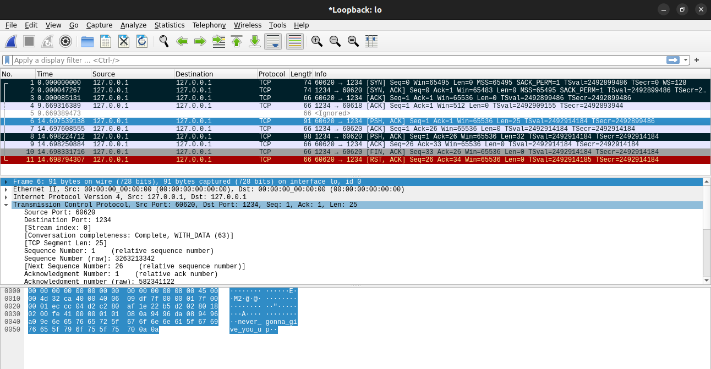

# GOtchu

**Author**: Mayhul

You are a hitman who want to contact to his client via chat. The client being paranoid sent encrypted message to you.
Can you tell the message?

Given to user:
- question/secAgent

**Solution**:

1. Make the file executable `chmod +x secAgent`

2. Run it using `./secAgent`

3. go tool objdump -s "main.main" secAgent 

4. movq (assuming you're talking about x86) is a move of a quadword (64-bit value). This particular instruction 

5. Reversing the text (due to LSB format) reveals the string `close_connection`. 

6. Finally getting all the conditions.

 

7. Now on the face you dont recieve the encoded message. Use wireshark to capture tcp packets and analyse it.

- In the below pcap file the first three marked packets are `syn  syn-ack  ack`, which every tcp connection has.
  
 

- In the forth marked packet you can see the plain-text which we sent to the server




- In the last packet seeing the hexdump


```
0000   00 00 00 00 00 00 00 00 00 00 00 00 08 00 45 00   ..............E.
0010   00 54 9f b6 40 00 40 06 9c eb 7f 00 00 01 7f 00   .T..@.@.........
0020   00 01 04 d2 ec d0 67 69 66 a0 60 db 30 6b 80 18   ......gif.`.0k..
0030   02 00 fe 48 00 00 01 01 08 0a 94 ab 5a 79 94 ab   ...H........Zy..
0040   5a 79 5a 48 4e 6a 65 30 64 50 58 7a 52 75 5a 46   ZyZHNje0dPXzRuZF
0050   38 31 64 57 4a 74 4d 58 52 66 64 47 67 78 63 33   81dWJtMXRfdGgxc3
0060   30 4b                                             0K

```

8. You will see plain text `ZyZHNje0dPXzRuZF81dWJtMXRfdGgxc3`  which is base64 encoded. Go to any online tool and decrypt it, you will get the flag `dsc{GO_4nd_5ubm1t_th1s}`


**Flag**: `dsc{GO_4nd_5ubm1t_th1s}`
