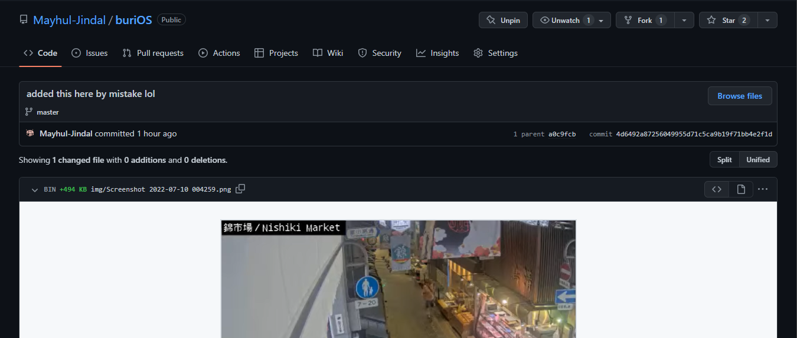
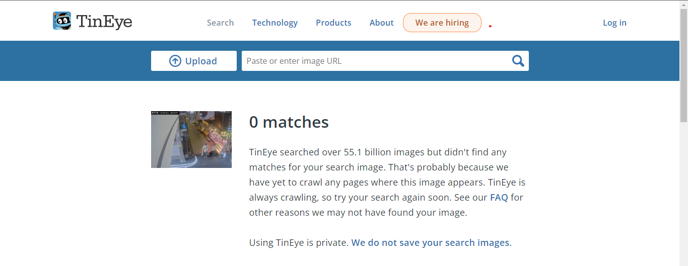
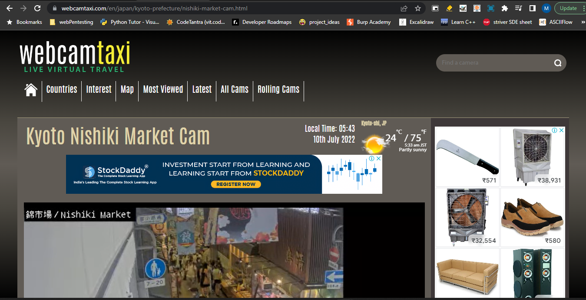
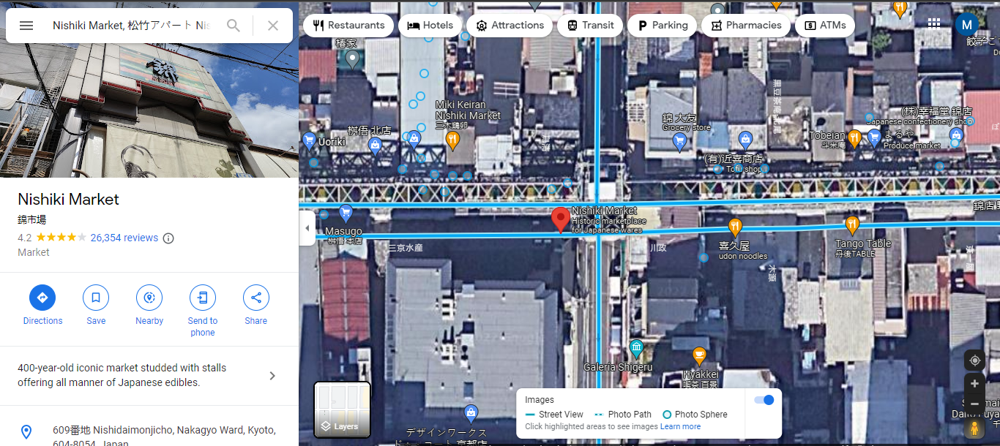
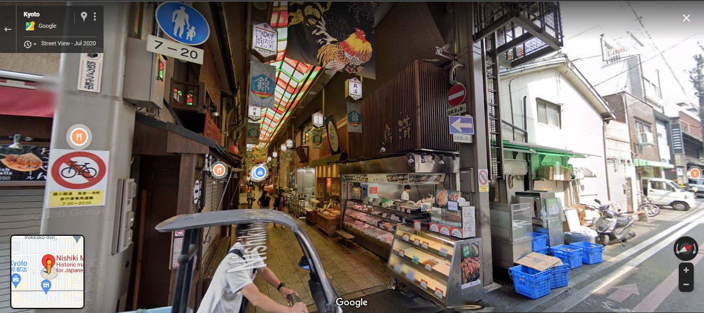
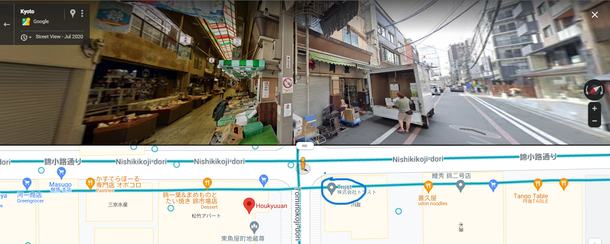
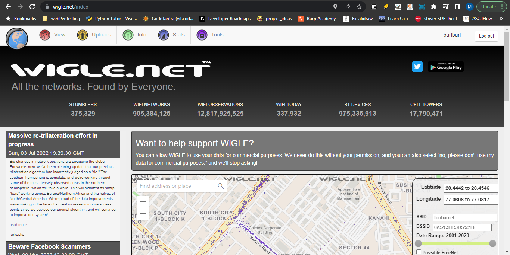
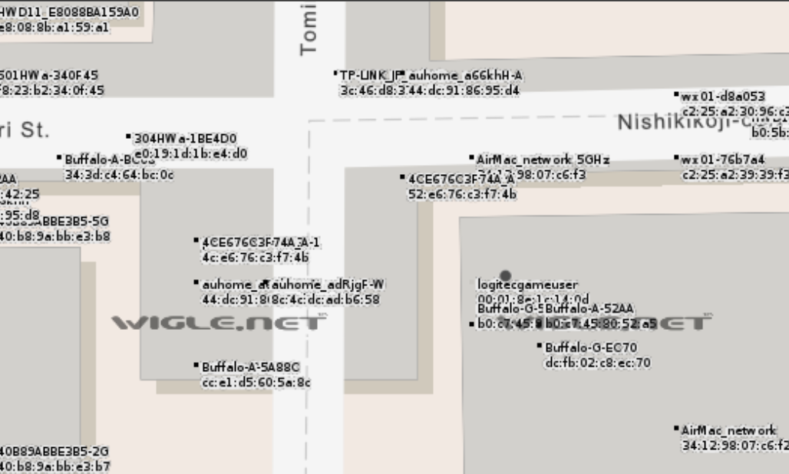

# MACnCheese

**Author**: Mayhul

**solution**:

- Search in github commits for the image added. 

- Try to reverse search this image on google or use [tineye](https://tineye.com/), but you wont get any result

- Search for nishiki market on google or you can even search for live webcams online [like this](https://www.webcamtaxi.com/en/japan/kyoto-prefecture/nishiki-market-cam.html). Here they have given the location too which makes it easy to find the exact location

- Use google maps to get to the final location and open street view like this.

- Here try to locate the board which you can see in the image. The cctv will be in opposite direcion to that board.

- Then get the location of the nearest shop to the cctv camera that is [trust](https://www.google.com/maps/place/Trust/@35.0050273,135.7648686,38m/data=!3m1!1e3!4m5!3m4!1s0x60010896cbc18ba1:0x216a495a8d0ff355!8m2!3d35.0049708!4d135.7649626?hl=en). Get its co-ordinates for further investigation `35.004980343058655, 135.76496252482968`

- Go on website [wigle](https://wigle.net/) to find the possible mac-address closest to the cctv camera using the co-ordinates

- Zoom in to see the mac-address which is `52:e6:76:c3:f7:4b`

Given to user:
- https://github.com/Mayhul-Jindal/

**Flag**: `dsc{}`