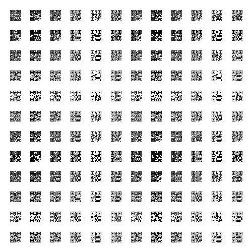

# worldTour 

**Author**: Mayhul

Sam visited many places but was in a hurry to tell all the places, so he gave me this :/

Given to user:
- travel_QR.png

**solution**:

You will get this photo



1. You can use an online tool like `https://demo6.dynamsoft.com/barcode-reader/`
> This will give you partial result, either you can choose pythonic approach using openCV or just manual labour


2. Then scaning QR code will give you message

`I_went_to_many_places_here_is_one_of_my_photo_please_have_a_look_else_i_will_be_sad_:(--->https://github.com/Mayhul-Jindal/trip_around_the_world`

Clicking on the link will lead you to


3. Then decoding the stegno file using any online tool will give you

```
[-38.39354689781145, 145.0772130718895]
[-38.20752196715849, 145.38811153336445]
[-38.31349609378215, 145.19683419403478]
{
[-38.06469157688977, 145.14606979384865]
[-34.749833570018886, 143.09930637364462]
[-34.749833570018886, 143.09930637364462]
[-38.20752196715849, 145.38811153336445]
[-37.8195319774246, 147.09189881119468]
[-37.99351186468697, 141.7214656773243]
[-38.04527942466805, 142.32591378361735]
}
```

4. These are the co-ordinates, and if you go to google maps and search these you can get characters for the flag


**Flag**: `dsc{goosint}`
