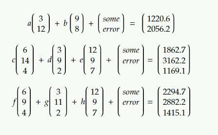

# ԍcᴉϝϝɑɼ

**Author**: Mayhul

Mike bought a quantumn computer which could easily break many of the public-key cryptosystems currently in use. Recently one of his friends send him an encrypted [message](https://www.math3d.org/ujb54miYM) and public and the private key as following:-

For text_1
```python

public
[3,12] # [x1,y1]
[9,8]  # [x2,y2]

private
[3,0]  # [x1,y1]
[0,2]  # [x2,y2]

```

For text_2
```python

public key
[6,14,4]  # [x1,y1,z1]
[3,9,2]   # [x2,y2,z2]
[12,9,7]  # [x3,y3,z3]

private key
[0,0,1]   # [x1,y1,z1]
[0,3,0]   # [x2,y2,z2]
[1,0,0]   # [x3,y3,z3]

``` 
For text_3
```python

public key
[6,9,4]   # [x1,y1,z1]
[3,11,2]  # [x2,y2,z2]
[12,9,7]  # [x3,y3,z3]

private key
[0,0,1]   # [x1,y1,z1]
[0,2,0]   # [x2,y2,z2]
[3,0,0]   # [x3,y3,z3]


```

He challenged mike to decrypt it, by also sending him how he encrypted `abcdefgh` :)



At first Mike was confident that it wouldn't be any trouble but soon realized he celebrated bit too early.

Given to user:
- All things are mentioned in the question itself

**Flag**: `dsc{hereItIs}`